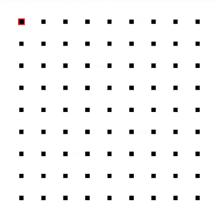

# 🗺️ Routing by PSO - JS

### Overview

This is a simple script written JavaScript that helps solve routing problems using [particle swarm optimization](https://en.wikipedia.org/wiki/Particle_swarm_optimization),<br>
It supports multiple points routing and barriers.

Here's a simple visualisation of the code example below using canvas:



For more complex scenarios check out the editor I built at [justkesha.github.io/routing-by-pso](https://justkesha.github.io/routing-by-pso),<br>
It includes a wide range of settings and brushes, as well as an [OpenStreetMap API](https://en.wikipedia.org/wiki/OpenStreetMap) integration.

### Usage

Here's a basic example with a 1 point search:
```js
var swarm = new Swarm(10, 10);
var speed = .5;

// Evenly distributing particles
for(let i = 1; i < swarm.plane.xMax; i += 1)
    for(let j = 1; j < swarm.plane.yMax; j += 1)
        swarm.entities.push(new SwarmEntity(i, j, speed));

// Adding 1 point to search at 1:1
swarm.objectives.push(new SwarmObjective(1, 1));

// Repeat 30 iterations
for(let i = 0; i < 30; i += 1)
    swarm.frame();
```

We can then check the average particle position to see if it works:
```js
console.log((arr => [
    arr.reduce((sum, obj) => sum + obj.x, 0) / arr.length,
    arr.reduce((sum, obj) => sum + obj.y, 0) / arr.length
])(swarm.entities));
```
Iteration 0: `[5, 5]`
Iteration 30: `[1.0845236605545332, 1.1649163955747983]`

### Explanation

Each particle of the swarm holds the following information:
1. Approximate distance to each target point
1. Current target point id
1. Direction angle
1. Speed

At the start the approximate distance to each point should be random or null.<br>
Then each iteration a particle will:
1. Increase the points distance by N
1. Communicate with the neighbors
1. Update direction
1. Take a step forward
1. See if it reached a target

Communication means sharing informations with the neighboring particles to find out who has lesser distance to point X stored.
The particles then update their point distances to be the smallest values among their neighbors + the distance to that neighbor.
And if the information about their current target was updated, they will rotate in the direction of the neighbor who shared that information.

Once a particle reaches a point it will update the distance to that point to be 0,<br>
And if it was the current target it will switch to the next.
